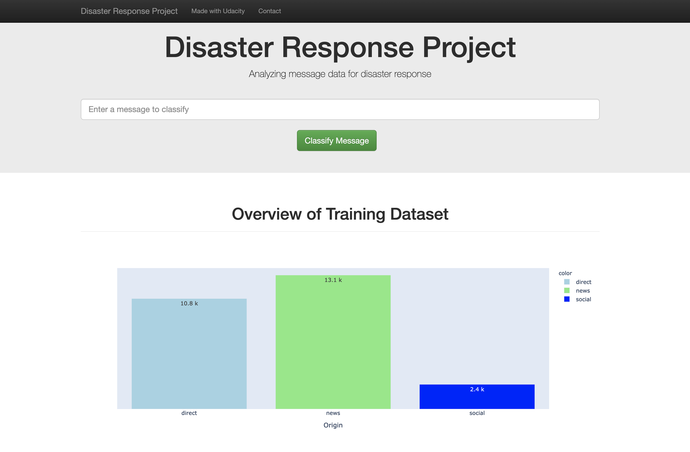
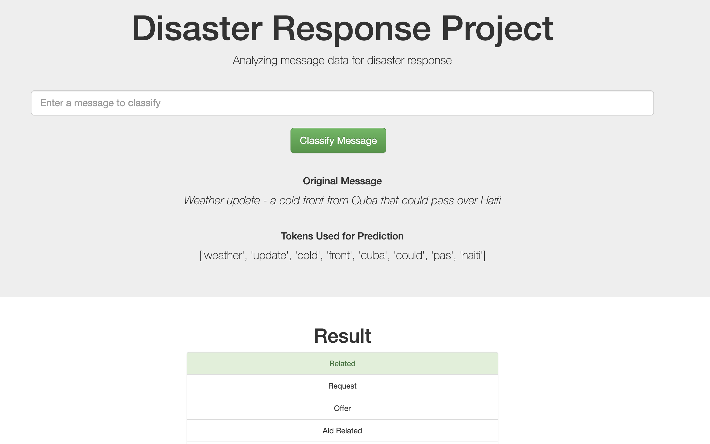

# Disaster Response Pipeline Project

This project is the result of the final excercise from Udacity's Data Science Nano Degree. The main idea is to provide a web app that allow the user to classify a provided message to different disaster categories. The Multiclass classification identifies multiple and simoltaneous classes.

In collaboration with **Figure Eight**, an AI company based on San Francisco, this application has the intention to provide a disaster
message classification. There's been more than 300,000 deaths over the last three decades due to Natural Disasters, and allowing 
local authorities and health organizations to recognize hotspots where people are struggling or suffering is crucial to reduce the impact of these 
events as much as possible. The application can be used within real-time scenarios, though re-train could be helpful to increase it's utility.

The model was trained using a Figure Eight dataset which contains messages from social media, SMS and articles, and multiple senders. Each message
indicates the class (or classes) of that message that indicate whether the message is for request first aid, food, and more.

</img>

### Instructions:
1. Run the following commands in the project's root directory to set up your database and model.

    - To run ETL pipeline that cleans data and stores in database, which will update the data based on both csv routes provided.
        `python data/process_data.py data/disaster_messages.csv data/disaster_categories.csv data/DisasterResponse.db`
    - To run ML pipeline that trains classifier and saves.
        `python models/train_classifier.py data/DisasterResponse.db models/classifier.pkl`

2. Run the following command in the app's directory to run your web app.
    `python run.py path_to_database path_to_model_pickle`

3. Go to http://0.0.0.0:3001/

### Files
Within the project three main folders can be find:
1. `./data`: holds all the logic to process the disaster data (both messages and categories), and upload it into a sqlite database.
2. `./models`: is in charge of gathering raw data from the previously populated database, perform the NLP pipeline, and train an AdaBoost classification model.
3. `./app`: creates all Plotly charts, executes the Flask App and waits for user requests.

#### Full File Tree

```
├── README.md
├── classification.png
├── disaster_response_pipeline_project
│    ├── app
│    │  ├── run.py
│    │  └── templates
│    │      ├── go.html
│    │      └── master.html
│    ├── data
│    │  ├── DisasterResponse.db
│    │  ├── disaster_categories.csv
│    │  ├── disaster_messages.csv
│    │  └── process_data.py
│    └── models
│        ├── __init__.py
│        ├── model.pkl
│        └── train_classifier.py
├── home.png
├── test.py
```


### Usage
The stored model consists of a AdaBoostClassifier trainer using **200 estimators**, and a **learning rate of 0.3**. This was the best model obtained using a GridSearch between multuple models and hyperparameters.

After the Flask application is started, a homepage with some metrics will be displayed. As the second figure shows, the dataset has highly unbalanced classes which complicates the overall training and tends to ease overfitting with any model.


The input on the top center block asks for a new message to classify.

</img>